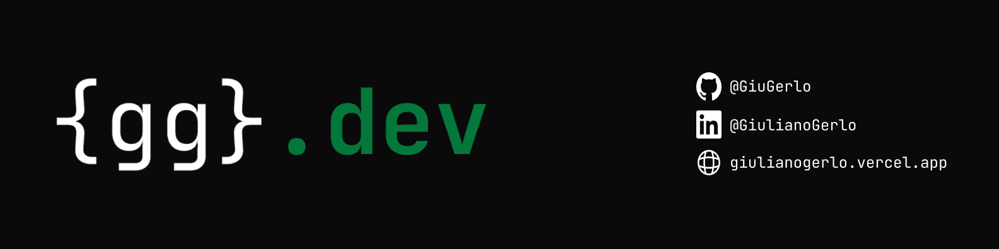

<!-- ──────────────────────────────────────────────────────────────── -->
<!-- Banner -->
<!-- ──────────────────────────────────────────────────────────────── -->

  

<h1 align="center">¡Hola! Soy Giuliano Gerlo 👋</h1>

  <strong>Full-Stack Developer</strong> · Rosario, Argentina 
  Técnico Superior en Desarrollo de Software · Asistente de Desarrollo en RAMCC

  
  
  
  

---

## 🧑‍💻 Sobre mí

- 🎓 **Técnico Superior en Desarrollo de Software** egresado del Terciario Brigadier López (Rosario).
- 💼 Actualmente **Asistente de Desarrollo en RAMCC** — Red Argentina de Municipios frente al Cambio Climático.
- 🛠️ Trabajo en software a medida, automatización de procesos y APIs.
- 🚀 Cada vez más metido en **desarrollo asistido por IA**: Claude Code, MCP, agentes.
- 📚 Cursando la **Certificación React Developer** en DigitalHouse (jun 2026).
- 🌎 Disponible para proyectos freelance, remoto o presencial en Rosario.

➡️ **Toda mi info, proyectos y CV están en mi portfolio:** [giulianogerlo.vercel.app](https://giulianogerlo.vercel.app)

---

## 🛠️ Tech Stack

#### Frontend

#### Backend

#### Bases de datos

#### DevOps / Tools

#### AI / Tooling

---

## 🚀 Proyectos destacados

| Proyecto | Descripción | Stack | Link |
|---|---|---|---|
| **🌳 Ecosistema RAMCC** | Sitios institucionales, aula virtual con Mercado Pago, sistema Mi-Huella (Flutter + API PHP) y censo CenArb (Flutter + Laravel). | PHP · Laravel · Flutter · Mercado Pago · Docker | [ramcc.net](https://ramcc.net/) |
| **💪 Personal Gym Tracker** | App de seguimiento de hipertrofia. React + PHP, multi-usuario, CI/CD propio a Hostinger con GitHub Actions. | React · PHP · MariaDB · GitHub Actions | [Detalle](https://giulianogerlo.vercel.app/proyectos/gym-tracker) |
| **🛍️ Next — Tienda de Ropa** | Sistema integral: ventas, pagos parciales, préstamos de prendas, dashboard con métricas y export Excel profesional. | PHP · MySQL · Bootstrap · DataTables · PhpSpreadsheet | [Repo](https://github.com/GiuGerlo/Next-Tienda) |
| **🏠 Inmobiliaria NZ** | Catálogo público con buscador instantáneo, mapa dinámico con clusters y panel admin con drag-and-drop. | PHP · MySQL · Google Maps API | [Live](https://nz-estudiojuridicoinmobiliario.com/) |
| **🛒 CloverTecno** | E-commerce de tecnología con checkout Mercado Pago, gestión de stock vía Excel y notificaciones por email. | PHP · MySQL · jQuery · Mercado Pago | [Live](https://clovertecno.com/) |
| **💰 Gestor de Finanzas** | Gestor multi-usuario de ingresos, gastos y gastos fijos con control de acceso por roles (RBAC) y auditoría. | PHP · MySQL · Bootstrap | [Detalle](https://giulianogerlo.vercel.app/proyectos/gestor-finanzas) |

👉 **Ver todos los proyectos en detalle:** [giulianogerlo.vercel.app](https://giulianogerlo.vercel.app/#projects)

---

## 📊 GitHub Stats

  

  

  

---

## 🎓 Formación

- 🏫 **Técnico Superior en Desarrollo de Software** — Terciario Brigadier López (Rosario, 2022–2024)
- 📜 **CoderHouse** — Desarrollo Web (ene–mar 2024) · JavaScript (ago–oct 2024)
- 🔄 **DigitalHouse** — Certificación React Developer (jun 2025 – jun 2026, en curso)

---

## 📫 Contacto

  <a href="mailto:ggiuliano526@gmail.com"><strong>ggiuliano526@gmail.com</strong></a> ·
  <a href="https://www.linkedin.com/in/giuliano-gerlo-21a7b8221/">LinkedIn</a> ·
  <a href="https://wa.me/5493468536422">WhatsApp</a> ·
  <a href="https://giulianogerlo.vercel.app">Portfolio</a>

  <em>Disponible para proyectos · Remoto o presencial en Rosario, Argentina</em>

